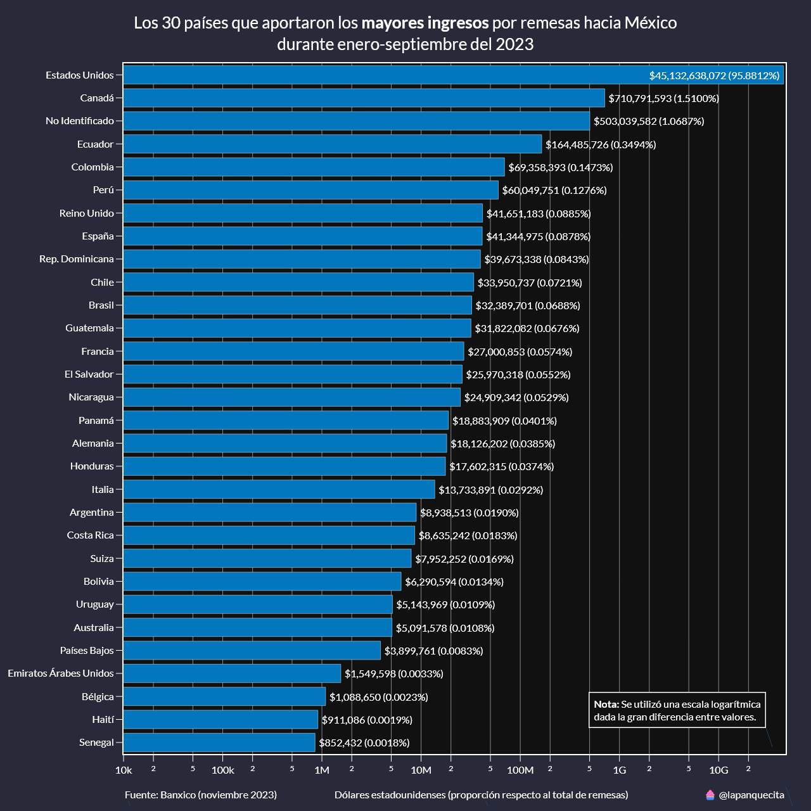
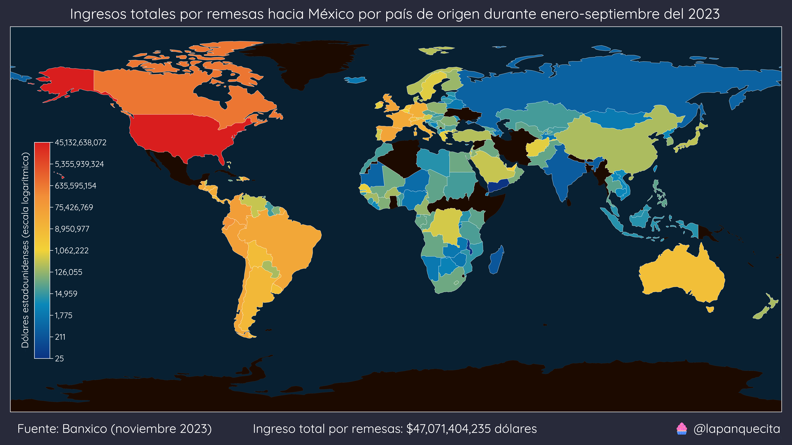

# Ingreos por remesas en México

Este repositorio incluye varios datasets y scripts para analizar los ingreos por remesas en México desde el año 2013 hasta la primera mitad del 2023.

Las remesas han ido en aumento, siendo los últimos meses máximos históricos. En este repositorio veremos de donde vienen y a donde llegan estas remesas.

## Remesas por país de origen

México recibe remesas de casi todos los países del mundo, sin embargo EE. UU. es el que más aporta, con el 96.03% del total de estas.

En la siguiente gráfica de barras se muestran los 30 países que más envían remesas hacia México. Se tuvo que usar una escala logarítmica para poder hacer una mejor comparación, dada la gran diferencia de cifras.

Del otro lado tenemos a los 30 países que menos remesas aportan. En esta gráfica no se muestran porcentajes ya que todos se aproximan al 0%.

Por último, tenemos un mapa Choropleth con la distribución espacial. Se puede apreciar que la mayoría de las remesas provienen de América y Europa occidental. También se se hizo uso de una escala logarítmica para poder distribuir mejor las cifras.

