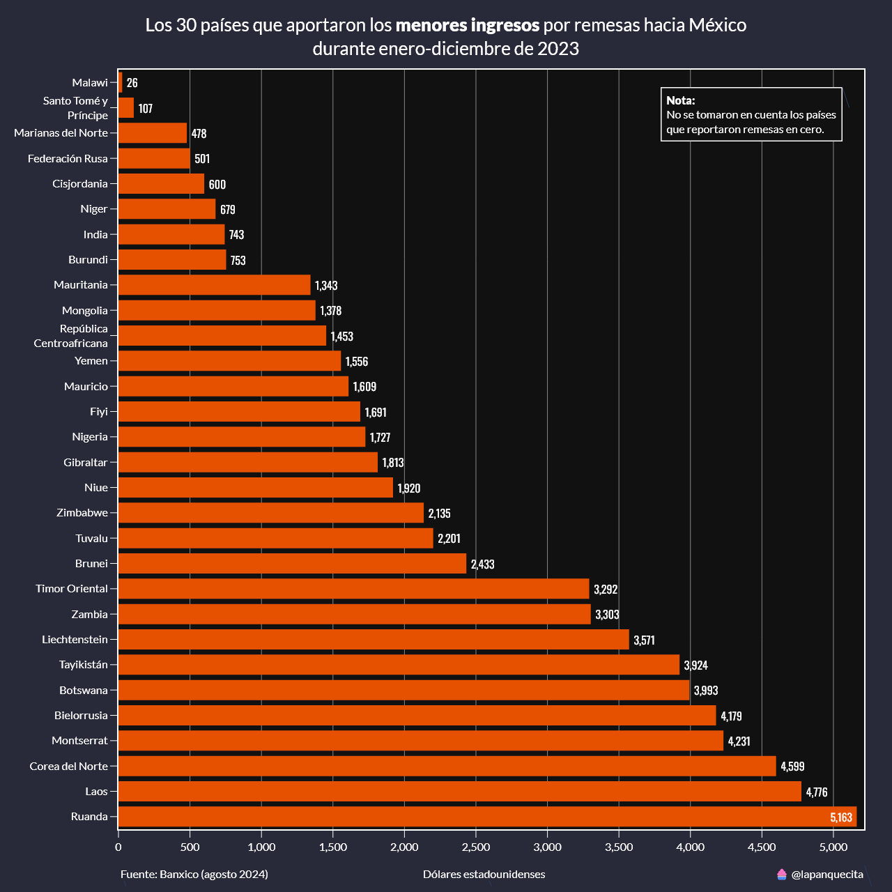
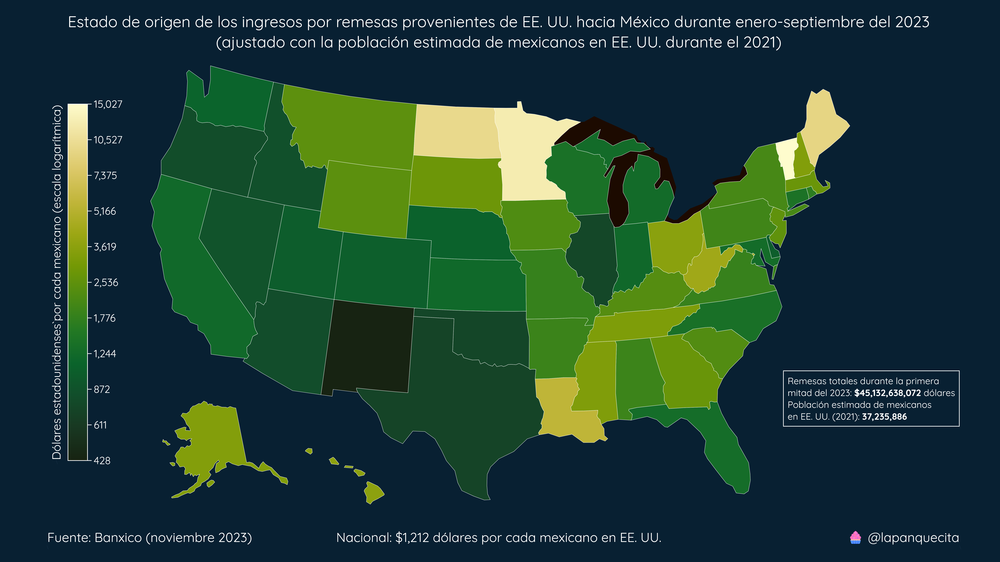
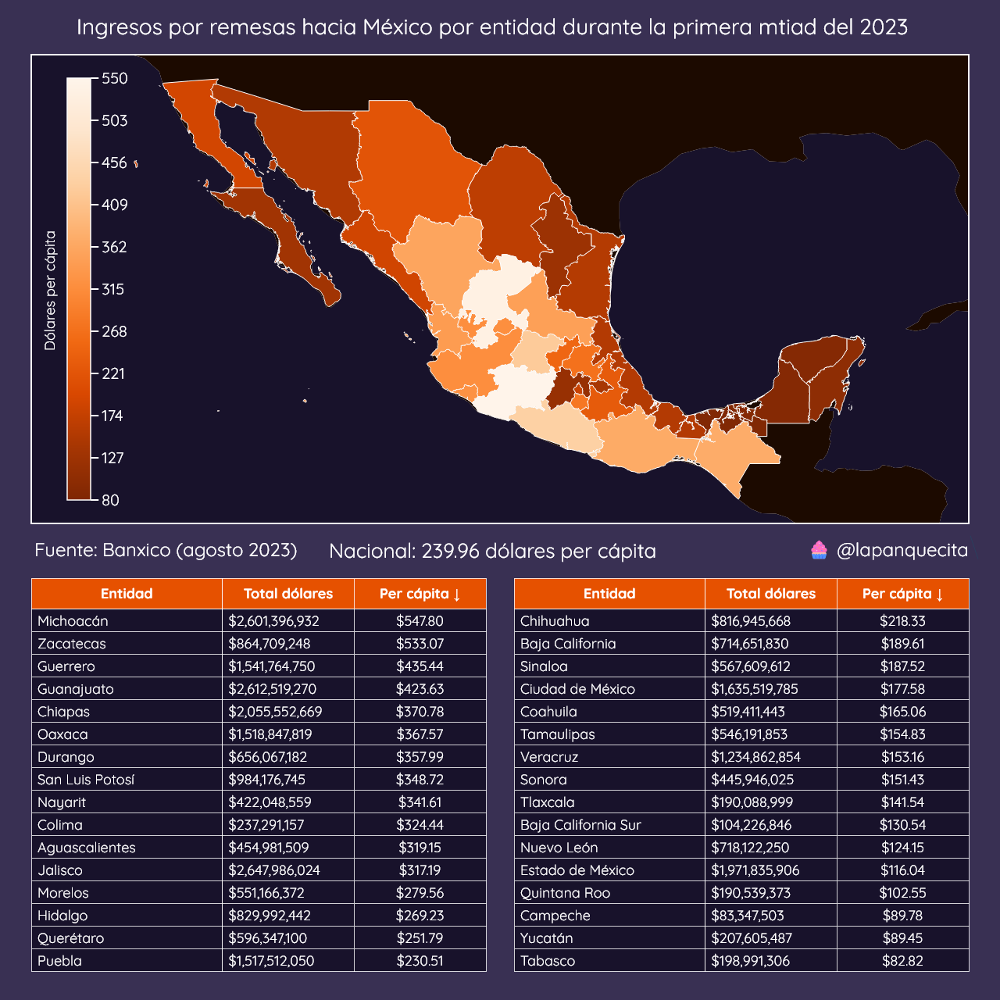
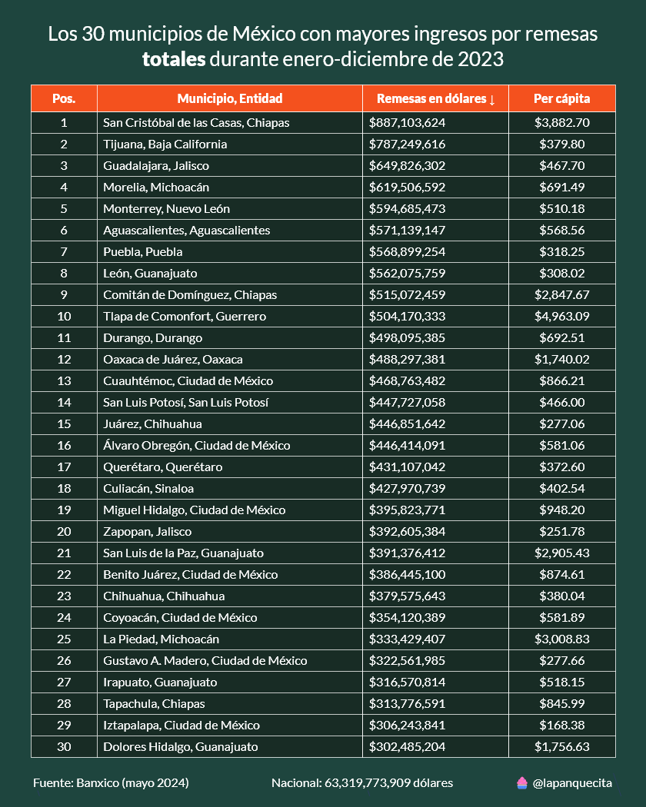
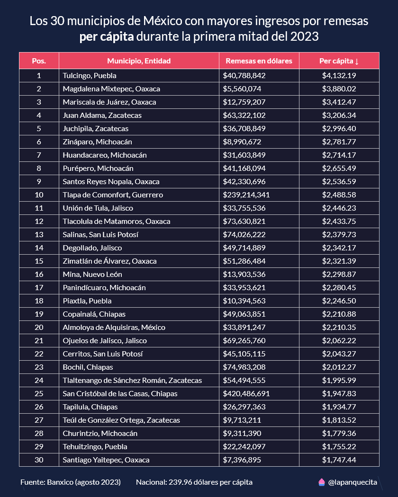

# Ingresos por remesas en México

Este repositorio incluye varios datasets y scripts para analizar los ingreos por remesas en México desde el año 2013 hasta la primera mitad del 2023.

Las remesas han ido en aumento, siendo los últimos meses máximos históricos. En este repositorio observaremos de donde vienen y a donde llegan estas remesas.

## Remesas por país de origen

México recibe remesas de casi todos los países del mundo, sin embargo EE. UU. es el que más aporta, con el 95.88% del total de estas.

En la siguiente gráfica de barras se muestran los 30 países que más envían remesas hacia México. Se tuvo que usar una escala logarítmica para poder hacer una mejor comparación, dada la gran diferencia de cifras.

Del otro lado tenemos a los 30 países que menos remesas aportan. En esta gráfica no se muestran porcentajes ya que todos se aproximan al 0%.

Por último, tenemos un mapa Choropleth con la distribución espacial. Se puede apreciar que la mayoría de las remesas provienen de América y Europa occidental. También se se hizo uso de una escala logarítmica para poder distribuir mejor las cifras.

## Remesas provenientes de EE. UU.

Como lo fue mencionado anteriormente, durante la primera mitad del 2023 EE. UU. aportó el 95.88% del total de las remesas hacia México.

Los 10 estados de EE. UU. que aportaron más remesas fueron:

| Estado     |         Total |
|:-----------|--------------:|
| California | 15,474,748,224 |
| Texas      |  6,875,342,549 |
| Minnesota  |  2,488,315,490 |
| Arizona    |  1,628,990,549 |
| Georgia    |  1,515,909,994 |
| Illinois   |  1,299,805,883 |
| Florida    |  1,018,050,306 |
| Nueva York |    981,018,053 |
| Colorado   |    951,716,358 |
| Washington |    902,820,311 |

Aquí tenemos el problema que la mayoría de estos estados también son los que tienen la mayor población de mexaicanos. Debemos ajustar estas cifras para tener un mejor punto de comparación.

*Nota: Es importante recordar que no todos los mexicanos que viven en EE. UU. mandan dinero a México. No pude encontrar información exacta de cuantos migrantes mexicanos viven en EE. UU., así que utilicé la información más cercana dispoible.*

Ahora bien, aquí esta la tabla de los 10 estados que más enviaron remesas a México ajustado con la población de mexicanos:

| Estado           |         Total |  Per cápita |
|:-----------------|--------------:|---------:|
| Vermont          |    60,496,783 |   15,027 |
| Minnesota        | 2,488,315,490 |   12,443 |
| Dakota Del Norte |   205,991,987 |    9,782 |
| Maine            |    75,675,961 |    9,262 |
| Puerto Rico      |    49,197,465 |    8,116 |
| Luisiana         |   382,602,079 |    5,562 |
| West Virginia    |    46,179,372 |    4,235 |
| Washington, D.C. |    48,418,209 |    4,226 |
| Hawaii           |   190,035,304 |    3,621 |
| Ohio             |   755,823,138 |    3,558 |

En el siguiente mapa Choropleth se puede observar la distribución completa. También se utilizó una escala logarítmica dada la diferencia entre los primeros valores.

## Ingresos por entidad

Ya sabemos de donde vienen las remesas, ahora falta saber a donde llegan. En el sigiente mapa y tablas se muestra la distribución por entidad federativa.

Michoacán, Zacatecas y Guerrero ocupan los primeros 3 lugares una vez ajustadas las cifras per cápita. Estas 3 entidades actualmente tienen un problema muy grave de seguridad, se puede inferir que por los altos niveles delictivos, es preferible recibir dinero del extranjero a emprender un negocio.

## Ingresos por municipio

La información por entidad nos da una perspectiva generalizada de la distribución de las remesas, pero también es importante ir más a detalle y saber exactamente en que municipios están llegando. En la siguiente tabla se muestran los 30 municipios que han recibido el mayor número de remesas durante la primera mitad del 2023:

La mayoría de estos municipios coinciden con las ciudades más grandes del país. Debemos ajustar estas cifras con la población de cada municipio para conocer su impacto económico.

Ahora sabemos que en Chiapas, Michoacán, Oaxaca, Puebla y Zacatecas es donde las remesas tienen mayor impacto económico.

## Conclusión

La tendencia nos indica que cada año las remesas están aumentando, sabemos que casi en su totalidad provienen de Estaods Unidos y Canadá y que los estados más afectados por la inseguridad tienen un ingreso mayor remesas que los que no.

El aumento de remesas es un indicador que suele mal interpretarse, se piensa que es algo bueno que cada vez se reciba más dinero de parientes en el extnrajero, pero en realidad es un síntoma de la falta de oportunidades en el país.
