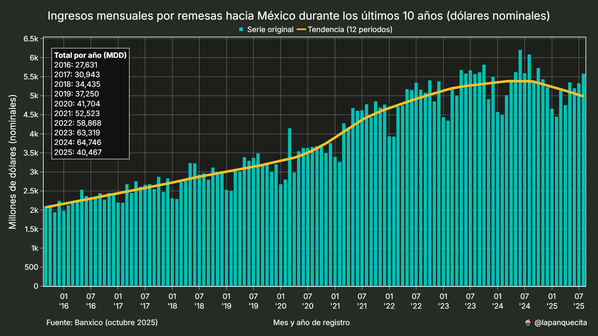
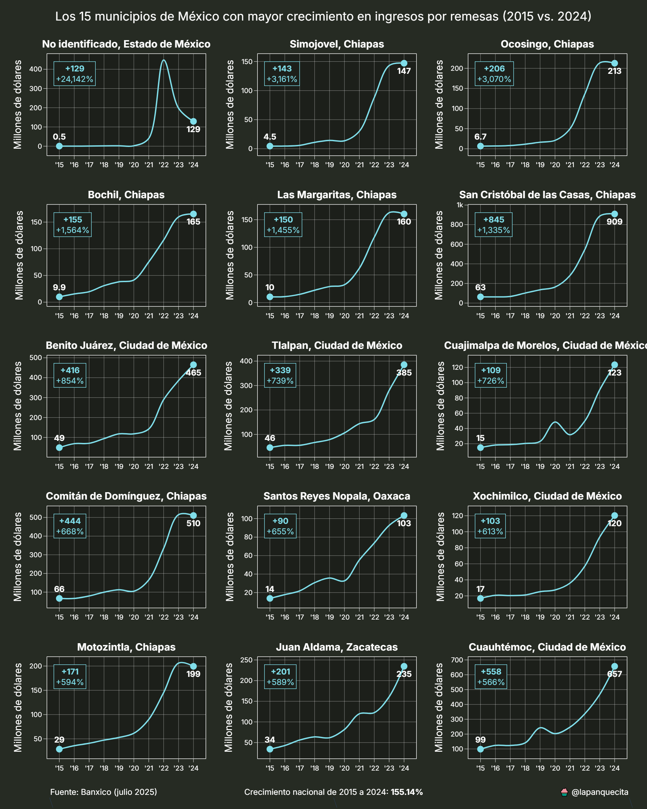
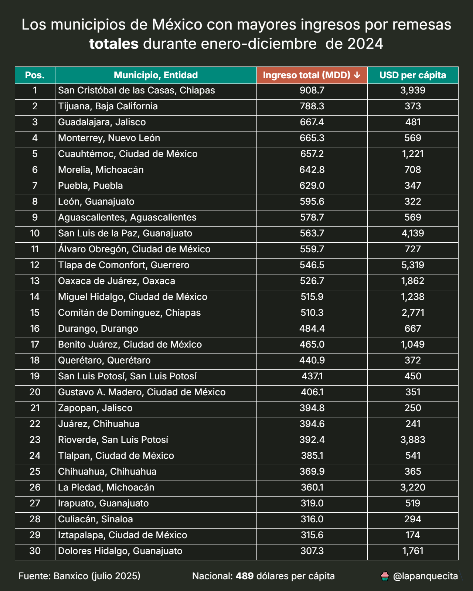
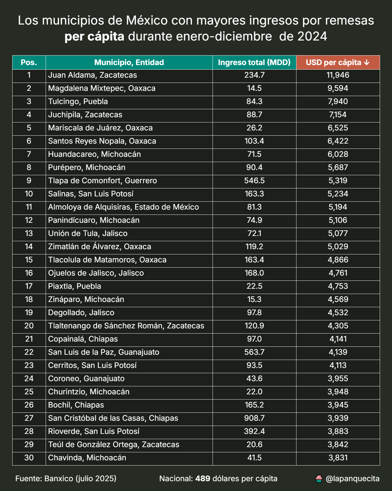
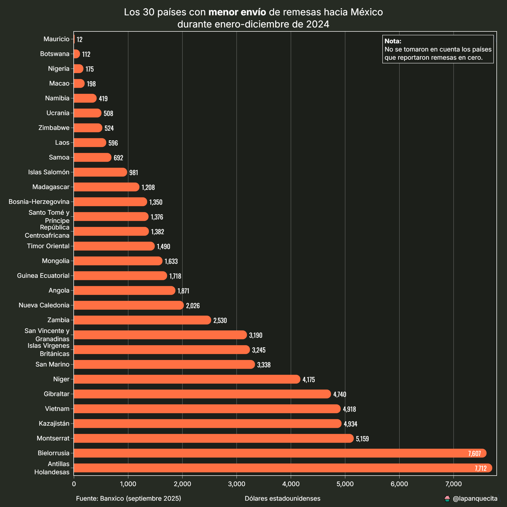
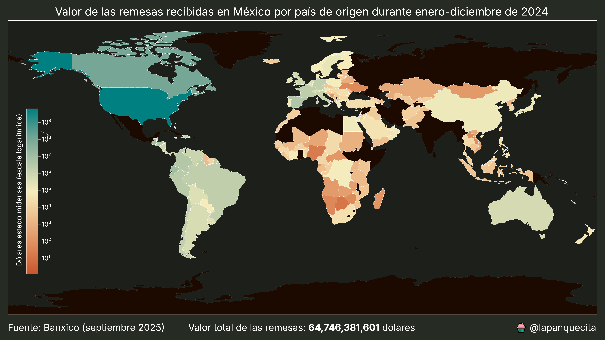
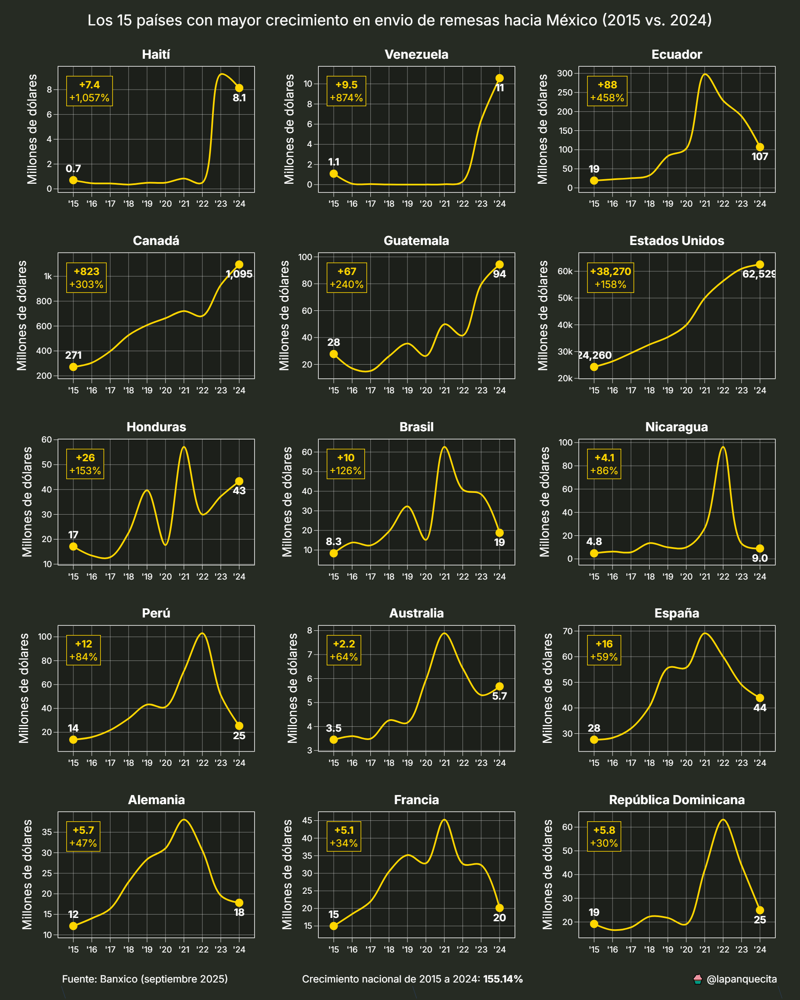

# Ingresos por remesas hacia México

Este repositorio contiene conjuntos de datos y scripts para la recolección, análisis y visualización de información pública sobre los ingresos y egresos por remesas en México.

La información se obtiene del [Sistema de Información Económica (SIE) de Banxico.](https://www.banxico.org.mx/SieInternet/consultarDirectorioInternetAction.do?&sector=1&accion=consultarDirectorioCuadros&locale=es#contenidoPrincipal)

El análisis de remesas se realiza desde distintas perspectivas:

* Temporal: mensual, trimestral y anual
* Geoespacial: por entidad federativa, municipio y país

Asimismo, se evalúa el impacto económico de las remesas a nivel micro y macroeconómico, utilizando proyecciones de población del CONAPO y datos del PIB estatal publicados por el INEGI.

---

## Estructura del repositorio

El repositorio está organizado en dos carpetas principales y varios scripts para procesar la información:

* Carpeta `assets`: contiene insumos y datos complementarios
* Carpeta `data`: contiene los conjuntos de datos principales de remesas
* Scripts en Python para descarga, limpieza y procesamiento de datos

---

## Archivos en `assets`

* `IPC.csv`: Índice Nacional de Precios al Consumidor (INPC), utilizado para ajustar los valores de remesas a pesos reales
* `USDMXN.csv`: Promedio mensual del tipo de cambio peso-dólar, usado para convertir cifras de USD a MXN
* `PIBE_2018.csv`: Producto Interno Bruto estatal (base: segunda quincena de 2018)
* `poblacion.csv`: Población municipal estimada por el CONAPO
* `mexico.json`: GeoJSON con la división política de México a nivel estatal
* `municipios.zip`: contiene `municipios.json`, un GeoJSON con la división política a nivel municipal

---

## Archivos en `data`

* `remesas_mensuales.csv`: valor y número de operaciones de remesas por mes a nivel nacional
* `remesas_entidad.csv`: ingresos trimestrales de remesas por entidad federativa
* `remesas_municipal.csv`: ingresos trimestrales de remesas a nivel municipal
* `remesas_pais.csv`: ingresos y egresos por remesas según país de origen o destino, de forma trimestral
* `remesas_usa.csv`: remesas trimestrales enviadas desde cada estado de Estados Unidos hacia México

## Scripts

Cada script del repositorio permite generar distintos análisis y visualizaciones a partir de los datos procesados. A continuación se describe el propósito de cada uno y se muestran ejemplos de sus resultados.

### `etl.py`

Este script automatiza el flujo de extracción, transformación y carga de datos:

1. Descarga los conjuntos de datos desde el Sistema de Información Económica de Banxico
2. Obtiene el INPC y el tipo de cambio FIX
3. Limpia y transforma la información a formato de panel de datos, lo que facilita su análisis posterior

Los archivos originales se descargan en formato XLS y se convierten a CSV para su uso en herramientas estadísticas y de visualización.

### `remesas_mensuales.py`

Este script analiza las cifras de remesas mensuales e incorpora una línea de tendencia calculada mediante descomposición STL, que ofrece mayor robustez frente a un promedio móvil simple.

La primera visualización muestra el valor nominal en dólares estadounidenses:

La segunda visualización presenta el valor nominal convertido a pesos mexicanos:

La tercera visualización muestra el valor real de las remesas, ya ajustadas por inflación:

Finalmente, la última gráfica presenta los totales anuales en pesos reales, útil para un análisis de largo plazo:

Para la conversión a pesos mexicanos se utiliza el tipo de cambio FIX publicado por el Banco de México.

El ajuste inflacionario se realiza empleando el Índice Nacional de Precios al Consumidor (INPC).

### `remesas_entidad.py`

Este script analiza el destino de los ingresos por remesas a nivel estatal y evalúa su relevancia económica.

La primera visualización es un mapa tipo choropleth que muestra el ingreso total por entidad federativa en millones de dólares y, adicionalmente, el ingreso per cápita. Se acompaña de una tabla con el desglose de estas cifras:

La segunda visualización permite realizar una comparación interanual, es decir, contrastar el mismo periodo de tiempo entre dos años diferentes:

La tercera visualización muestra la evolución del ingreso en las 15 entidades con mayor crecimiento, lo que permite identificar cuáles han incrementado su participación más rápidamente:

Finalmente, la última visualización presenta la relación entre el valor de las remesas y el PIB de cada entidad:

Es importante destacar que las remesas no forman parte del PIB. La comparación se realiza únicamente para dimensionar su impacto económico relativo en cada entidad federativa.

### `remesas_municipio.py`

Este script analiza las remesas a nivel municipal.

La primera visualización es un mapa tipo choropleth que muestra el ingreso per cápita por municipio, acompañado de estadísticas descriptivas para comprender mejor la distribución:

La segunda visualización presenta los 15 municipios con mayor crecimiento en remesas recibidas:

El script también genera dos tablas con los 30 municipios con mayores ingresos, tanto en valores absolutos como per cápita:

La tabla per cápita resulta especialmente interesante, ya que evidencia que algunos municipios reciben cantidades muy elevadas en proporción a su población:

La población utilizada proviene de las proyecciones de población publicadas por el CONAPO.

### `remesas_pais.py`

Este script identifica de qué países provienen las remesas enviadas a México y a qué países se dirigen las remesas salientes desde México.

La primera visualización muestra los 30 países que más dinero enviaron a México. Para representar adecuadamente la gran diferencia entre los primeros lugares y el resto, se emplea una escala logarítmica:

La segunda visualización presenta a los 30 países que enviaron menos dinero a México:

Posteriormente, se incluye un mapa mundial tipo choropleth que muestra la distribución geográfica completa de los ingresos. Al igual que en la gráfica del top 30, se utiliza una escala logarítmica:

Finalmente, se presenta la tendencia de los 15 países que han enviado mayores cantidades de remesas a México:

Todas estas visualizaciones pueden generarse tanto para los ingresos de remesas hacia México como para los egresos de remesas desde México.

## Conclusión

Este proyecto ofrece un conjunto integral de herramientas y datos para analizar el comportamiento de las remesas hacia y desde México, tanto en el tiempo como en el espacio geográfico.

La estructura modular de los scripts permite estudiar el fenómeno desde distintas perspectivas: nacional, estatal, municipal y por país, facilitando la comparación, la detección de tendencias y la evaluación de impactos económicos relativos.

La combinación de fuentes oficiales, como Banxico, CONAPO e INEGI, asegura la calidad y confiabilidad de la información, mientras que el procesamiento automatizado garantiza la reproducibilidad de los resultados.

Esto convierte al repositorio en una base sólida para estudios académicos, análisis de políticas públicas y exploraciones económicas orientadas a comprender el papel de las remesas en la economía mexicana.